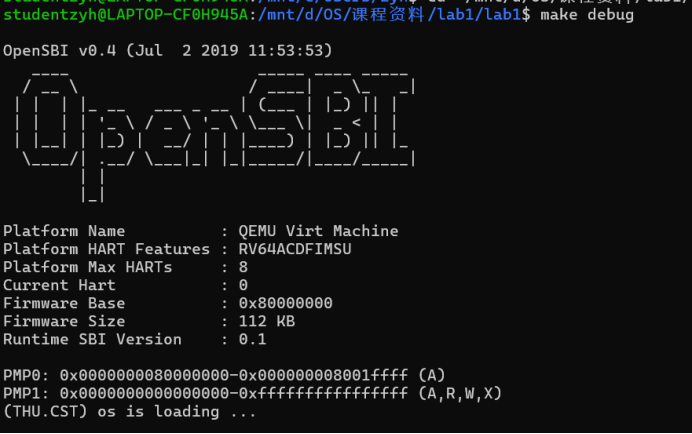
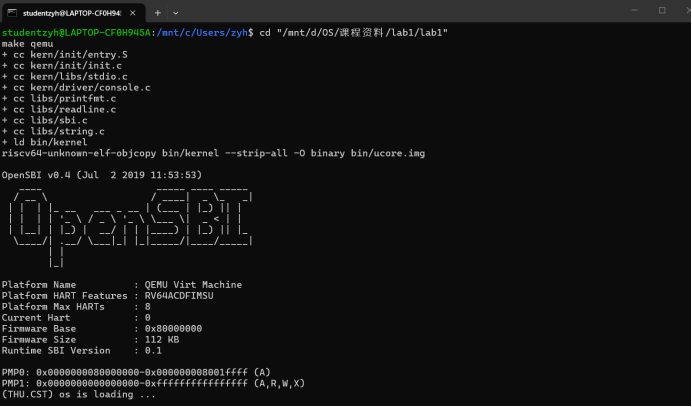

# 实验报告

## 实验基本信息

| 项目 | 内容 |
|------|------|
| **实验名称** | Lab1：最小内核启动与 GDB 跟踪 |
| **小组成员** | 2513907-薛欣宜、2513447-黄天怡、2510943-张艺涵 |
| **完成日期** | 2026-10-08 |

### 小组分工

本次实验涉及代码环境搭建以及工具使用与学习，故由每个组员分别完成后汇总。

| 成员 | 负责的练习/模块 |
|------|----------------|
| 2513907-薛欣宜 | all |
| 2513447-黄天怡 | all |
| 2510943-张艺涵 | all |


---

## 一、实验目的

<!-- 说明本次实验的主要目标和预期成果 -->

本实验的主要目的是：

1. 目的1：理解内核启动中的程序入口操作、理解链接脚本描述的内存布局、用SBI组成stdio、make的工具原理
2. 目的2：借助 QEMU 模拟和 GDB 跟踪整个启动流程
3. 目的3：学习如何借助AI工具（VSCode + 桌面端）辅助学习和开发
---

## 二、实验环境

你们使用的 AI 工具

| 成员 | AI 编程工具 | 底层模型 | 备注 |
|------|------------|---------|------|
| 2513907-薛欣宜 | Codex | GPT-6 Sol | 通过 Codex 答疑、核对启动流程并辅助整理报告 |
| 2513447-黄天怡 | Claude | deepseek V4 flash |用于理解实验文档、答疑、辅助撰写报告 |
| 2510943-张艺涵 | Codex | GPT-6 Sol | 通过 Codex 答疑、核对启动流程并辅助整理报告 |


## 三、实验整体逻辑分析

### 3.1 逻辑主线

先准备能在 RISC-V 上运行的内核镜像，再建立从固件到内核的交接，最后利用固件提供的控制台服务验证内核已运行。对应的构建过程和运行过程分别是：

```text
源代码 → 交叉编译得到目标文件 → 链接为 bin/kernel（ELF）
       → objcopy 导出 bin/ucore.img（原始二进制镜像）

QEMU virt 复位代码（0x1000）→ OpenSBI（0x80000000）
       → kern_entry（0x80200000）→ kern_init → 控制台输出 → 无限循环
```


### 3.2 功能的先后关系

1. **构建镜像并确定地址**：链接脚本确定内核布局，构建工具生成可供 QEMU 放入内存的镜像；没有正确的地址布局，后续跳转无法进入预期代码。
2. **运行平台启动代码与 OpenSBI**：复位代码提供下一阶段的入口和启动参数，OpenSBI 完成固件初始化，再交接给内核。
3. **建立内核自身的运行环境**：`kern_entry` 先把栈指针 `sp` 指向内核预留的启动栈，再跳到 C 函数 `kern_init`，使后续函数调用有可用的栈空间。
4. **清零并输出**：`kern_init` 清零相应内存，通过 SBI 控制台服务打印启动信息，验证这一条执行链已经到达内核。
---

## 四、实验内容与实现

<!-- 
说明：本部分按照 exercises 文档中的练习顺序组织
每个功能模块或者练习中可能包含多项任务，请根据实际情况调整
-->
### 1. `tools/kernel.ld`：确定内存布局和入口

链接脚本通过 `ENTRY(kern_entry)` 指定 ELF 入口，通过 `BASE_ADDRESS = 0x80200000` 确定内核起始地址，并安排各段：

| 段 | 内容 |
|---|---|
| `.text` | 可执行机器指令 |
| `.rodata` | 字符串常量等只读数据 |
| `.data`、`.sdata` | 带初始值的可写数据 |
| `.bss` | 需要初始化为零的静态存储数据 |

链接脚本还定义 `edata`、`end` 等地址符号，供初始化代码确定清零区域。

真正执行链接的是 `ld`。它根据链接脚本组织目标文件、分配地址并解析符号引用。

### 2. `Makefile`：组织构建与模拟运行

Makefile 依次组织以下过程：

```text
.c、.S → gcc 编译 → .o → ld 链接 → bin/kernel
       → objcopy 导出 → bin/ucore.img
```

使用 `riscv64-unknown-elf-` 工具链，是因为编译环境与目标 RISC-V 机器的架构不同。

其中：

- `bin/kernel` 是 ELF 文件，包含程序及符号、调试信息。
- `bin/ucore.img` 是原始二进制镜像，由 QEMU loader 加载到指定地址。

`make qemu` 用于运行实验；`make debug` 使用 `-s` 提供 GDB 调试端口，使用 `-S` 在启动时暂停 CPU。

### 3. `entry.S`：建立启动栈

核心代码为：

```asm
kern_entry:
    la sp, bootstacktop
    tail kern_init
```

`la sp, bootstacktop` 将栈指针设置为启动栈顶。启动栈大小为两页，即 8 KiB，栈向低地址增长。

`tail kern_init` 跳转到 C 初始化函数，不安排返回到此入口。

该模块将固件交接后的执行状态衔接到内核自己的 C 运行环境。`kern_entry` 是内核的汇编入口，`kern_init` 是 C 初始化入口。

### 4. `init.c`：完成基本初始化

核心代码为：

```c
int kern_init(void) {
    extern char edata[], end[];
    memset(edata, 0, end - edata);

    const char *message = "(THU.CST) os is loading ...\n";
    cprintf("%s\n\n", message);

    while (1)
        ;
}
```

`edata` 和 `end` 是链接器定义的地址符号。`memset` 将对应内存区域清零，以满足 BSS 数据的零初始化要求。

随后调用 `cprintf` 输出启动信息，最后进入无限循环。此时尚未实现进程调度，循环用于使内核保持运行。

### 5. 打印模块：从格式串到终端输出

打印调用链为：

```text
cprintf
    ↓
vcprintf
    ↓
vprintfmt
    ↓
cputch
    ↓
cons_putc
    ↓
sbi_console_putchar
    ↓
sbi_call
    ↓ ecall
OpenSBI 控制台服务
    ↓
模拟串口
    ↓
终端
```


格式化模块通过回调输出字符，使格式处理与具体输出方式分离。

本实验使用传统 SBI 控制台接口：`a7` 保存服务编号，`a0` 保存待输出字符，`ecall` 发起请求。每输出一个字符，就请求一次 SBI 服务；OpenSBI 完成服务后返回内核继续执行。

### 6. 支持代码与生成产物

| 目录 | 作用 |
|---|---|
| `kern/init/` | 内核入口与初始化 |
| `kern/driver/` | 控制台接口，目前借助 SBI 完成输出 |
| `kern/libs/` | 内核输入输出函数 |
| `kern/mm/` | 页大小、启动栈大小等定义，尚未实现完整内存管理 |
| `libs/` | 字符串处理、格式化、SBI 调用及基础定义 |
| `tools/` | 链接脚本与构建辅助规则 |
| `obj/` | 目标文件、依赖记录、反汇编和符号表 |
| `bin/` | 最终 ELF 内核与原始镜像 |

其中，`.o` 文件已包含机器代码，但仍可能存在待链接的符号引用；`.d` 文件记录头文件依赖；`kernel.asm` 和 `kernel.sym` 分别用于观察机器指令与符号地址。


## 五、测试与验证
### 练习情况：
#### 练习一：理解内核启动中的程序入口操作
1. la sp, bootstacktop：设置内核栈指针，使栈指针sp指向一片有效内存，这里bootstacktop是栈顶。
2. tail kern_init ，表示跳转至init.c（内核入口），对内核进行初始化，保证数据的0初始化，并完成后续的信息输出。
#### 练习二： 使用GDB验证启动流程
- 跟踪 QEMU 模拟的 RISC-V 从加电开始，直到执行内核第一条指令（跳转到 0x80200000）的整个过程。
- RISC-V 硬件加电后最初执行的几条指令位于什么地址？它们主要完成了哪些功能？请在报告中简要记录你的调试过程、观察结果和问题的答案。
### 实验结果：



### 调试过程与观察结果：
- 开始调试，CPU从复位地址开始执行OpenSBI的固件初始化
1. 最初执行的指令如下：
``` bash
(gdb) display/i $pc
│1: x/i $pc
│=> 0x1000:      auipc   t0,0x0
│(gdb) x/10i 0x1000
│=> 0x1000:      auipc   t0,0x0
│   0x1004:      addi    a1,t0,32
│   0x1008:      csrr    a0,mhartid
│   0x100c:      ld      t0,24(t0)
│   0x1010:      jr      t0
│   0x1014:      unimp
│   0x1016:      unimp
│   0x1018:      unimp
│   0x101a:      0x8000
│   0x101c:      unimp
```
2. 关键指令：jr t0
```bash
(gdb) si                           
│0x0000000000001010 in ?? ()
│1: x/i $pc
│=> 0x1010:      jr      t0
│(gdb) info registers pc t0 a0 a1 a2
│pc             0x1010   0x1010
│t0             0x80000000       2147483648
│a0             0x0      0
│a1             0x1020   4128
│a2             0x0      0
```         
3. 继续向下执行（si），此时跳转至opensbi的入口，PC 变成 0x80000000                                                                
- 断点1：break kern_entry:
1. 内核被加载到0x80200000的时候，pc也指向相同地址；
```bash
   pc             0x80200000       0x80200000 <kern_entry>
   sp             0x8001bd80       0x8001bd80  
```
2. 接下来执行栈指针的设置：
```bash
#向下查看 5条指令
=> 0x80200000 <kern_entry>:     auipc   sp,0x3
│   0x80200004 <kern_entry+4>:   mv      sp,sp
│   0x80200008 <kern_entry+8>:   j       0x8020000a <kern_init>
│   0x8020000a <kern_init>:      auipc   a0,0x3
│   0x8020000e <kern_init+4>:    addi    a0,a0,-2
```
- 断点二：break kern_init:
1. 此时栈指针已经完成设置；(0x80201000到0x80203000为栈空间，对应8 KiB 启动栈，栈由高向低增长)
```bash
   pc             0x8020000a       0x8020000a <kern_init>
   sp             0x80203000       0x80203000 <SBI_CONSOLE_PUTCHAR>
```  
2. 进入C函数初始化；

### 问题解答：
- 最初几条指令的功能：准备启动参数，读取opensbi入口并跳转至对应地址。
- t0：opensbi入口；
- a0：当前硬件线程编号；
- a1：传给固件的设备树地址。
``` bash
(gdb) display/i $pc
│1: x/i $pc
│=> 0x1000:      auipc   t0,0x0
│(gdb) x/10i 0x1000
│=> 0x1000:      auipc   t0,0x0 #基准地址
│   0x1004:      addi    a1,t0,32
│   0x1008:      csrr    a0,mhartid
│   0x100c:      ld      t0,24(t0) #从基准地址加偏置后的地址取出opensbi的入口地址
│   0x1010:      jr      t0 #跳转至入口地址
│   0x1014:      unimp
│   0x1016:      unimp
│   0x1018:      unimp
│   0x101a:      0x8000
│   0x101c:      unimp
```
## 六、重要知识点与 OS 原理的对照

1. **系统启动流程。** 含义：从加电到内核运行的层级接力。与 OS 原理对应的是"BIOS/UEFI → bootloader → 内核"。关系：本实验把这条链具体落地了，OpenSBI 扮演 bootloader 的角色；差异在于实验用 QEMU 模拟 + OpenSBI，真实机器用 UEFI + GRUB，但"三级跳"的架构完全一致。

2. **内存布局与链接。** 含义：用链接脚本把内核固定到某个地址并排列各段。对应 OS 原理中的程序装入、链接与地址空间。关系：链接脚本里"合并段、符号解析、重定位"正是原理中链接与重定位的具体体现；差异是原理偏抽象，实验直接给出了 `0x80200000` 这样的确定地址。

3. **交叉编译。** 含义：在一种平台上生成另一种平台的机器码。对应编译原理与计算机组成中的目标代码生成。关系：宿主 x86、目标 riscv64，所以必须用目标为 riscv64 的编译器。

4. **SBI 与 ecall。** 含义：内核通过 `ecall` 陷入请求固件服务。对应 OS 原理中的特权级（M/S/U）与系统调用。关系：内核用 ecall 请求固件的服务和用户态用系统调用陷入内核，是同一种"特权级切换 + 陷入"机制。

5. **栈与函数调用约定。** 含义：栈存放临时数据，栈指针指向栈顶并向下生长。对应 OS 原理与 ABI 中的栈帧和调用约定。关系：`entry.S` 建栈是 C 代码能运行的前提；差异是原理讲抽象约定，实验里是具体的一条 `la sp, bootstacktop`。

6. **ELF 与链接/加载。** 含义：ELF 以结构化的方式描述程序布局。对应 OS 原理中可执行文件的格式与加载。关系：加载器读 ELF、恢复内存布局即可运行；差异是实验里由 objcopy 和 QEMU 简化了这一过程。

7. **固件** 含义：提供平台早期初始化及底层服务的软件。对应启动机制与硬件抽象。固件与内核职责不同：本实验中固件负责底层支持，内核在 S-mode 执行操作系统代码。

---

## 七、OS 原理中重要、但本实验未对应的知识点

- **中断（有一点）与异常处理**
- **物理内存管理与页表 / 虚拟内存**
- **进程管理与调度**


### AI 协作开发的经验

在 AI 协作方面，我们对使用AI辅助理解代码有了新的体会，发现着重学习代码的核心部分，可以避免被细节困扰，从而提升阅读速度。

---

